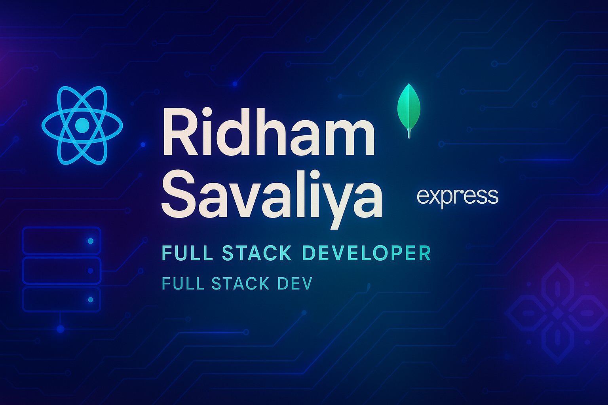

# Hello World!, I'm Ridham, a Indian Web Developer 👋🏼:
🛜 currently working on my own SaaS product CollaborativeX - AI-powered whiteboard  
👨🏼‍🎓 Studied at Veer Narmad South Gujarat University  
👨🏼‍💻 Working as a web developer since 2024

# 💻 Tech Stack:

<picture>
  <source media="(prefers-color-scheme: dark)" srcset="https://raw.githubusercontent.com/tobiasmeyhoefer/tobiasmeyhoefer/output/github-snake-dark.svg" />
  <source media="(prefers-color-scheme: light)" srcset="https://raw.githubusercontent.com/tobiasmeyhoefer/tobiasmeyhoefer/output/github-snake.svg" />
  
</picture>
